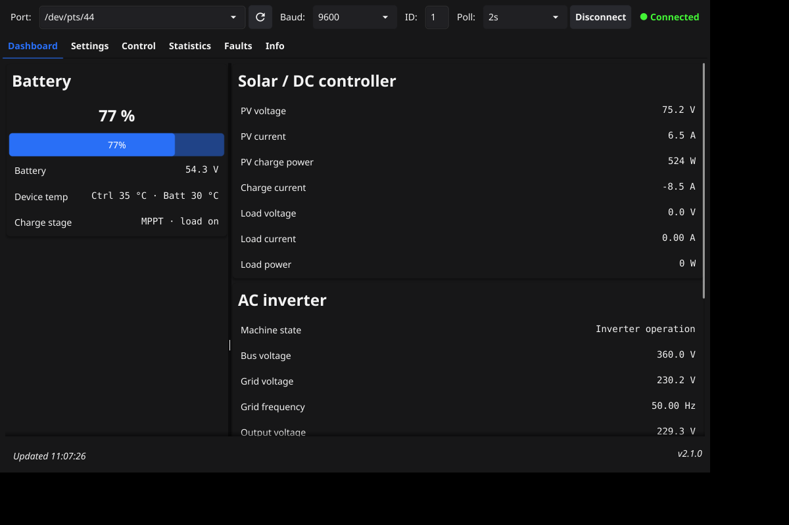
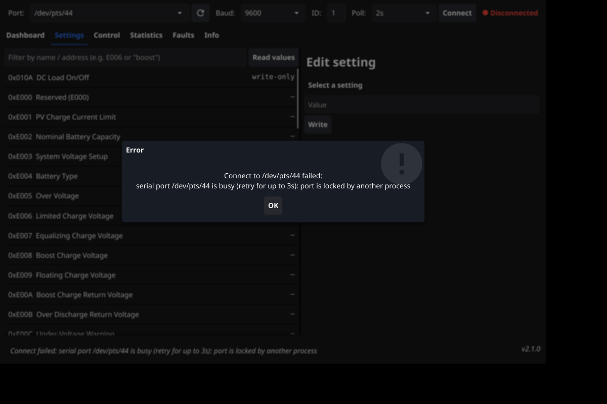

# SRNE Solar Manager

[](https://github.com/wltbagent/srne-solar-manager/actions/workflows/ci.yml)
[](https://go.dev)
[](#requirements)
[](#license)

**Monitor and configure SRNE-based all-in-one solar inverters over Modbus RTU** — a Fyne desktop app, a scriptable CLI, and a built-in device simulator, built against the *Modbus Register Address — Integrated Inverter Controller V1.3* specification ([`reference/`](reference/)).

<p align="center">
  
  
</p>

## Highlights

- **Live dashboard** — state of charge, battery voltage/current (signed: discharge reads negative), PV power, grid/output voltage and frequency, temperatures, charge stage, and a decoded fault banner
- **Parameter editor** — every read/write setting with live values, enum dropdowns, ranged sliders, write confirmation, and automatic readback verification
- **Device control** — power on/off, reset, factory defaults, clear alarms/statistics/history, equalization, DC load on/off, device clock sync, and a timestamped activity log
- **Statistics & fault history** — daily and accumulated energy figures, 7-day history table, decoded controller fault bits, inverter fault codes, and the 16-record fault log
- **Hardware-aware Modbus** — merged block reads (24-register cap — real SRNE gateways reject larger requests), inter-frame pacing, and per-block failure backoff so one dead address area can't stall polling
- **Works without hardware** — `devsim` is a virtual SRNE controller on a PTY for end-to-end testing
- **Debuggable** — every error also hits stderr with timestamps and block addresses; a "show raw values" toggle exposes the exact Modbus words behind each reading

## Contents

- [Requirements](#requirements)
- [Install](#install)
- [GUI](#gui)
- [CLI](#cli)
- [Simulator](#simulator)
- [Modbus register map](#modbus-register-map)
- [How it talks to the device](#how-it-talks-to-the-device)
- [Troubleshooting](#troubleshooting)
- [Development](#development)
- [Hardware smoke checklist](#hardware-smoke-checklist)
- [License](#license)

## Requirements

- **Linux** (developed and tested on Linux; the CLI needs any system with a serial device)
- **Go 1.24+** with a C toolchain (`gcc`) to build from source
- X11/OpenGL development packages for the GUI: `libgl1-mesa-dev`, `xorg-dev` (Debian/Ubuntu names)

## Install

```bash
git clone https://github.com/wltbagent/srne-solar-manager
cd srne-solar-manager
sudo make install
```

That builds and installs three binaries to `/usr/local/bin` (honor `PREFIX`/`BINDIR`/`DESTDIR` for custom or staged installs):

| Binary | Purpose |
|---|---|
| `charge-controller-gui` | Desktop monitoring/configuration app |
| `charge-controller` | CLI for scripting and headless use |
| `devsim` | Virtual SRNE controller for hardware-free testing |

## GUI

Start it with `charge-controller-gui` (or `make run`). Pick the port — the drop-down lists detected `/dev/ttyUSB*` and `/dev/ttyACM*` nodes, and the ↻ button re-scans — then set baud (default 9600 8N1) and device ID, and hit **Connect**. Monitoring starts automatically and the connection is remembered between launches.

| Tab | Contents |
|---|---|
| **Dashboard** | Battery card (SOC, voltage, dual temperature, charge stage), solar/DC and AC inverter live values, decoded fault banner, pause, raw-value view |
| **Settings** | All RW parameters with values, name/address filter, category filter, enum dropdowns or ranged sliders, write + readback |
| **Control** | Power / alarms / charging / DC-output command groups with confirmations, device clock sync, activity log |
| **Statistics** | Today's and accumulated energy figures, 7-day history table |
| **Faults** | Current controller fault bits and inverter fault codes, 16-record fault history with timestamps |
| **Info** | Product model, CPU/board versions, serial numbers, manufacture date, compile time |

Launch flags: `-port`, `-baud`, `-device`, `-tab <0-5>`, `-connect`. Ticking **Show raw values** appends the raw Modbus word to every reading — the fastest way to sanity-check an odd number against the device.

Errors appear in the status bar **and** on stderr with timestamps, so launching from a terminal gives copy-pasteable diagnostics:

```
2026/09/13 09:42:28 block 0x0100 (14 regs): serial: timeout
```

## CLI

```bash
charge-controller list --configurable        # parameter catalogue with ranges and enums
charge-controller status                     # live readings
charge-controller get 0xE001                 # one register (by address or name)
charge-controller set "PV Charge Current Limit" 60
charge-controller control power-on
charge-controller monitor --interval 2s
charge-controller dump --start 0x0100 --count 16
```

Global flags on any command: `-port /dev/ttyUSB0 -device 1 -baud 9600`.

## Simulator

`devsim` speaks Modbus RTU (FC03/06/16) as a virtual SRNE controller on a PTY, seeded with plausible values, jitters live data every 2 s, and survives client disconnects:

```bash
devsim
#   Port:  /dev/pts/44
charge-controller-gui -port /dev/pts/44 -connect
```

Or in one step: `make demo`. Point `-deny 0x0204` at it to emulate unresponsive address areas (useful for testing the poll backoff).

## Modbus register map

| Category | Range | Access |
|---|---|---|
| Product Info | 0x000A–0x0049 | R |
| Controller Data | 0x0100–0x010C | R/W |
| Inverter Data | 0x0200–0x0225 | R |
| Device Control | 0xDF00–0xDF0D | W |
| Battery Params | 0xE000–0xE025 | RW |
| Inverter Settings | 0xE200–0xE215 | RW/W |
| Statistics | 0xF000–0xF04B | R |
| Fault History | 0xF800–0xF8F0 | RW |

Contiguous registers are read as merged blocks of at most 24 registers (see [How it talks to the device](#how-it-talks-to-the-device)), so a full dashboard refresh is a handful of bus transactions instead of one request per register.

## How it talks to the device

Lessons from real hardware, encoded in the defaults:

- **Serial**: 9600 8N1 Modbus RTU; an advisory `flock` prevents two tools from driving one port.
- **Block reads**: requests are merged into ≤24-register blocks aligned to register boundaries — larger requests time out or return `gateway path unavailable` exceptions on real units.
- **Pacing**: a short quiet gap after every transaction keeps integrated gateways from dropping back-to-back frames.
- **Backoff**: a poll block that fails 3 times in a row is skipped for 60 s (one stderr notice), then retried — a dead area can't stall the dashboard.
- **Startup order**: tab loads run sequentially *before* the poll loop starts.
- **Threading**: all serial I/O happens on background goroutines; UI updates go through `fyne.Do`. The `Controller` serializes bus access, so reads, writes, and polling never collide.

## Troubleshooting

- **"serial port … is busy"** — another process holds the port (including a second instance of this tool). Close it or wait; the GUI retries for ~3 s before reporting.
- **`block 0x… : serial: timeout` on stderr** — that address area didn't answer. If it repeats every poll for a specific block, the poll loop backs off automatically; persistent timeouts on all blocks usually mean baud rate, wiring, or slave ID.
- **GUI won't start in headless sessions** — the Fyne GUI needs X11/GL; run it from a desktop session or via `xvfb-run` for headless smoke tests. The CLI works anywhere.
- **Weird values** — tick *Show raw values* on the Dashboard and compare against the CLI's `get` output, which prints the raw word.

## Development

```bash
make help        # list every target
make check       # gofmt check + go vet + tests (what CI runs)
make demo        # simulator + GUI in one command
```

```
├── cmd/
│   ├── charge-controller/     # CLI
│   ├── charge-controller-gui/ # Fyne desktop app
│   └── devsim/                # virtual controller
├── internal/
│   ├── controller/            # Modbus client, register map, block planner, decoders
│   └── devsim/                # simulator device + PTY helper
└── reference/                 # V1.3 Modbus specification (PDF)
```

CI ([`.github/workflows/ci.yml`](.github/workflows/ci.yml)) runs the same checks on every push and pull request.

## Hardware smoke checklist

1. `charge-controller status -port /dev/ttyUSB0` prints live values.
2. GUI connects; the status dot turns green and dashboard values refresh at the poll interval.
3. Unplug the adapter → the error surfaces in the status bar/stderr without freezing; replug and **Connect** recovers.
4. Change a harmless setting (e.g. *PV Charge Current Limit*), confirm the readback dialog reports the device's new value.
5. **Control → Sync device clock**; verify on the device display.
6. Statistics and Faults tabs populate; Info shows model, versions, and serial.
7. Start a second instance while one is connected — it must report the port as busy, not hang.

## License

Proprietary — all rights reserved.
